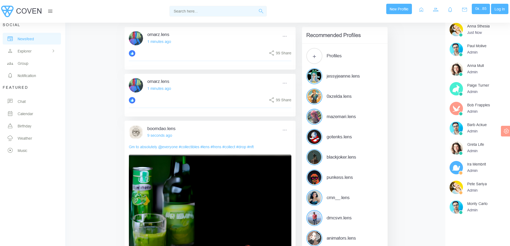
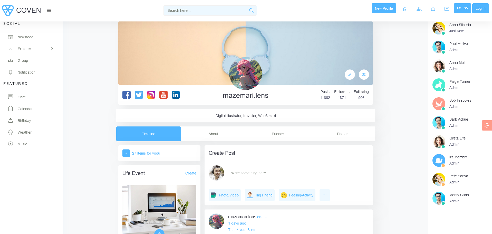
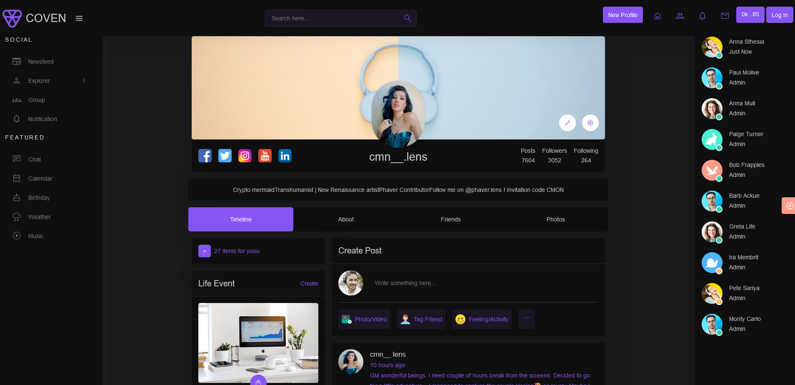

# COVEN

Coven is a decentralized social network application built on the Lens Protocol. Content creators on Coven are in complete control of their data and each user profile is a Non-Fungible Token (NFT).

Unlike most other decentralized social network applications, Coven hopes to implement "Engagement Rewards" to users who engage with creator's contents within the "Acceptable Reward Criteria". When users engage with posts and comments, users get to decide the payout of those posts. This way, quality content creation is rewarded by other users.

Coven leverages and customizes the Lens Protocol's social graph.

## Creating a profile on the Lens Protocol is currently gated, however other creators' posts can be seen and appreciated.

## Video Demo
[Watch here:](https://www.loom.com/share/d6cf582341b54aeda4abc44c7b0d5c1d/)

## Live Application

[Live Application:](https://subtle-cendol-5c5a65.netlify.app/)

See the live application here:

## Screenshots
Timeline



Profile



Dark Mode


## Problem Statement

- Corporate entities control major social media sites, and a small group of people within these companies sets the rules of engagement.
- This has raised concerns about free speech and censorship among users.
- Invasive advertising by centralized networks and the risk to privacy.

## Our Solution

- Coven is a A decentralized social network built on top of the Lens Protocol which gives users more control.
- This application is censorship resistant, gives ownership to users over personal data, and improved control over user-generated content.
- Instead of invasive advertisement, Covven promotes new forms of monetization to manage liquidity pool for incentivization.

## Built With
- Lens Protocol
- React/Redux
- JavaScript
- Typescript
- IPFS
- Ethers
- HTML5
- CSS3
- Bootstrap

## Getting Started

Follow the simple intructions below to explore the application either on the live version or locally on your computer.

## Prerequisites
- Metamask wallet (Connected to the polygon network). Coven supports multiple wallets.

### Live Application

[Live Application:](https://subtle-cendol-5c5a65.netlify.app/)

## Local Version

### Prerequisites
- You must have node installed on your computer. Download Node.js
- Metamask wallet (Connected to the polygon mainnet network) 

### Steps
- Go to the "Code" section of this repository and press the green button that says "Code". Copy the URL or the SSH key.
- Go to the terminal and run:
```https://github.com/george-shammar/covens.git```

The URL or SSH are the links copied from the step above.
- If you don't have git installed, you can download this project and unzip it.
- Go to the "Code" tab and click on "Downlaod Zip"
- Change directory into the folder the application is saved. From the terminal, run:
```cd directory```

Where "directory" is the name of the folder.
- Once you have the local copy in your desired folder, go back to your terminal and run:
```yarn install``` 
or 
```yarn```

This command installs all the dependencies of the application.

To open up the application in your browser, run:
```yarn start```

The application should open up at http://localhost:3000/

## Usage
NB: This is only an MVP, most part of the application are still being actively developed so placeholders are still being used in some parts of the website given the limited time. Significant development effort is expected to continue.

- Click the "Connect" icon to connect a wallet of your choice.
- Creating a profile on the Lens Protocol is currenlty gated. However, if you have a Lens profile you can login.

##  Contributing
Contributions, issues and feature requests are welcome!

## Credits
- Lens Protocol

